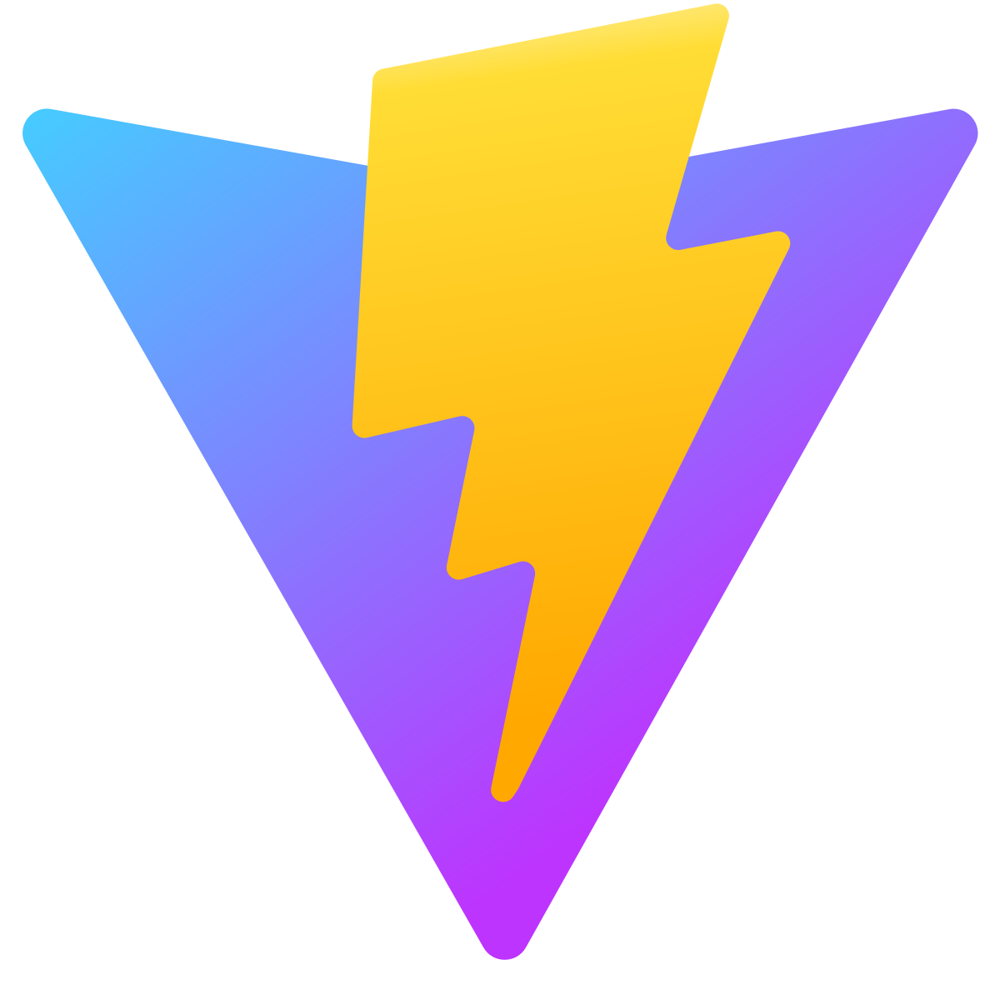
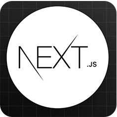
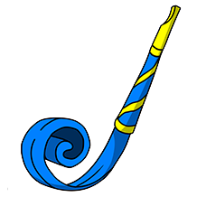

<!-- ============================================================
                             HEADING
============================================================== -->
<h1 align="center"> Hello there... I am Shourav Rajbongshi </h1>

<!-- ============================================================
                             TITLE
=============================================================== -->
## <h2 align="center"></h2>
      
<!-- ============================================================
                      PROFILE BANNER IMAGE
============================================================== -->

<!-- ============================================================
                        TROPES
============================================================== -->

  

<!-- ============================================================
                       PROFILE VIEWER
============================================================== -->

  

<!-- ============================================================
                  PRESENT PRIMARY INFO
============================================================== -->

- 🌱 I’m currently learning **System Design**

- 👨‍💻 All of my projects are available at [https://developer-shourav.vercel.app](https://developer-shourav.vercel.app/)

- 📝 I at [LinkedIn](https://www.linkedin.com/in/developer-shourav)

- 💬 Ask me about ***Full Stack Development + AI Automation***

- 📫 How to reach me <a href="mailto:developer.shourav1@gmail.com" target="_blank">developer.shourav1@gmail.com</a>

- 📄 Know about my experiences <a href="https://drive.google.com/file/d/11bI7iWEpeg5-WLUKDxUOqx5nLlQFZqi8/view?usp=sharing" target="_blank" >Download My
  resume</a>

<!-- ============================================================
                   MY CONTACT INFORMATION
============================================================== -->

## Connect with me:

 

 

<!-- ============================================================
                    MY SKILLS INFORMATION
============================================================== -->

## Languages and Tools:

 

    

<!--     -->
 

<!--    -->

<!--      -->
 
 
 
 
 
 

  

 

 
 

<!--============================================================
                      Experience Section
===============================================================-->
## Experience

**💻 AI & Software Engineer**\
**🏢 Butterfly Digital · Full-time  -(Remote)**\
📆 Jul 2025 - present\
📍 Toronto, Canada

 

**💻 MERN Stack Developer**\
**🏢 Bigmod Technologies · Full-time  -(Remote)**\
📆 Jun 2024 - Jul 2025\
📍 Holding # 457, DIT Road, 3rd Floor, West Rampura, Dhaka-1219.

 

**💻 Frontend Developer**\
**🏢 Shothik AI · Full-time  -(Remote)**\
📆 Oct 2024 - Jan 2025\
📍 London, UK

 

**💻 Frontend Developer (Next.Js)**\
**🏢 Zonely · Full-time  -(Hybrid)**\
📆 Dec 2023 - Sep 2024\
📍 Sonir Akhra, Dhaka

 

**💻 Frontend Developer (React.Js)**\
**🏢 IONIC Corporation · Full-time -(On-site)**\
📆 Sep 2023 - Dec 2023\
📍 Proschim Rayarbag, Jattrabari, Dhaka-1362

<!--============================================================
                       Github Stats Section
===============================================================-->
## Github Stats

 
 

<!--============================================================
                       Educational Background Section
===============================================================-->
## Education

  
📃 &nbsp;Academic Qualification

 

- 📖 **&nbsp;Bachelor of Business Administration**\
📆 &nbsp;2021 - present\
📍 **&nbsp;National University Of Bangladesh** -  Dhaka-1320, Bangladesh

- 📖 **&nbsp;HSC**\
📆 &nbsp;2018 - 2020\
📍 **Government Doar Nawabgonj College and University** - Nawabgonj, Dhaka, Bangladesh

- 📖 **&nbsp;SSC**\
📆 &nbsp;2017 - 2018\
📍 **&nbsp;Nawabgonj Govt. Pilot High School** - Nawabgonj, Dhaka, Bangladesh

 

<!--============================================================
                       FIRST FOOTER BANNER
===============================================================-->
<!--  -->

<!-- ============================================================
                DEVELOPER SHOURAV'S GITHUB STATS
============================================================== -->
<!-- 

 

 -->
<!-- ============================================================
                DEVELOPER SHOURAV'S GITHUB STREAK
============================================================== -->
<!-- 

 

 -->

<!-- 

 
 

 -->

<!-- ============================================================
                        FOOTER BANNER
============================================================== -->

